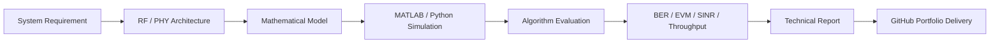

<!-- GitHub Profile README for dipucwc -->

<p align="center">
  
</p>

<p align="center">
  <a href="https://www.linkedin.com/in/md-moklesur-rahman-65a63962/">
    
  </a>
  <a href="https://github.com/dipucwc">
    
  </a>
  
  
</p>

<p align="center">
  
</p>

---

## 👋 About Me

I am a wireless systems engineer focused on **5G NR / 6G radio systems, RF/PHY algorithm design, beamforming calibration, MIMO-OFDM simulation, and RF architecture verification**.

My background combines **radio system specification, MATLAB/Python-based physical-layer simulation, RF calibration workflow analysis, and embedded/RF validation support**. I previously worked as a **Senior System Specifications Engineer at Nokia Solutions and Networks Oy**, contributing to radio features related to **beamforming, beamforming calibration, synchronization and timing, carrier configuration, and system-level RF requirements**.

This GitHub profile is structured as a professional wireless-engineering portfolio: each repository is intended to show **problem definition, mathematical model, algorithm workflow, simulation implementation, results, and technical documentation**.

---

## 🎯 Technical Positioning

<table>
<tr>
<td width="50%">

### Wireless / RF Systems
- 5G NR / LTE radio systems  
- TDD/FDD radio operation  
- Massive MIMO and beamforming  
- Beamforming calibration concepts  
- RF architecture and system requirements  
- Synchronization, timing, and carrier configuration  

</td>
<td width="50%">

### Simulation / Implementation
- MATLAB wireless simulation  
- Python numerical modeling  
- MIMO-OFDM link-level simulation  
- Channel estimation and equalization  
- EVM, BER, SINR, throughput analysis  
- C/C++ and embedded workflow fundamentals  

</td>
</tr>
</table>

---

## 🚀 Featured Portfolio Repositories

<table>
<tr>
<td width="50%">

### 📡 5G NR / 6G Wireless Engineering Portfolio  
**Repository:** [`5G-NR-6G-Wireless-Engineering-Portfolio`](https://github.com/dipucwc/5G-NR-6G-Wireless-Engineering-Portfolio)

Professional portfolio covering wireless-system concepts, 5G/6G PHY topics, RF system design, simulation methodology, and validation-oriented documentation.

**Core focus**
- 5G NR / 6G wireless system engineering  
- PHY/RF simulation and analysis  
- Wireless portfolio documentation  
- Research-to-engineering presentation style  

</td>
<td width="50%">

### 🧠 PHY Algorithm Design & Firmware Implementation  
**Repository:** [`PHY-Algorithm-Design-Firmware-Implementation`](https://github.com/dipucwc/PHY-Algorithm-Design-Firmware-Implementation)

Algorithm-focused repository for physical-layer design, simulation-to-implementation thinking, and firmware-oriented structure.

**Core focus**
- OFDM synchronization module  
- MIMO-OFDM link-level simulator  
- Algorithm-to-firmware workflow  
- MATLAB, Python, C/C++ organization  

</td>
</tr>

<tr>
<td width="50%">

### 🛰️ 5G RF Architecture, Specification & Verification  
**Repository:** [`5G-RF-Architecture-Specification-Verification`](https://github.com/dipucwc/5G-RF-Architecture-Specification-Verification)

System-specification style repository focused on RF architecture, requirement flow, assumption tracking, and verification process mapping.

**Core focus**
- RF architecture assumptions  
- Specification process mapping  
- Requirement-to-verification thinking  
- Radio feature and system behavior analysis  

</td>
<td width="50%">

### 📶 RF & Microwave Circuit Design Portfolio  
**Repository:** [`RF-Microwave-Circuit-Design-Portfolio`](https://github.com/dipucwc/RF-Microwave-Circuit-Design-Portfolio)

RF/microwave-oriented portfolio structure for circuit-design learning, simulation documentation, and RF engineering project presentation.

**Core focus**
- RF/microwave circuit concepts  
- ADS/Cadence-style project organization  
- S-parameter and RF block analysis  
- Design documentation and validation thinking  

</td>
</tr>

<tr>
<td width="50%">

### 🔋 BLE 5 Energy-Efficiency Evaluation  
**Repository:** [`Energy-Efficiency-Evaluation-of-Bluetooth-5-BLE-5-Technology`](https://github.com/dipucwc/Energy-Efficiency-Evaluation-of-Bluetooth-5-BLE-5-Technology)

Research-oriented work based on Bluetooth Low Energy performance and energy-efficiency evaluation.

**Core focus**
- BLE 4 vs BLE 5 comparison  
- LE Coded PHY concept  
- Range and reliability analysis  
- MATLAB and measurement-based evaluation  

</td>
<td width="50%">

### 🌐 Multi-Connectivity in IoT Networks  
**Repository:** [`Multi-Connectivity-in-IoT-Network`](https://github.com/dipucwc/Multi-Connectivity-in-IoT-Network)

IoT connectivity simulation and performance-analysis project focused on network-level metrics.

**Core focus**
- Multi-connectivity performance  
- Throughput, latency, reliability  
- Packet-loss and traffic behavior  
- MATLAB-based evaluation workflow  

</td>
</tr>
</table>

---

## 🧩 Wireless System Engineering Workflow



---

## ⚙️ Tools & Technologies

<p align="center">
  
  
  
  
  
  
</p>

<p align="center">
  
  
  
  
  
</p>

---

## 📊 Engineering Metrics I Use

| Category | Metrics |
|---|---|
| Link-level performance | BER, BLER, EVM, SINR, throughput, spectral efficiency |
| RF/PHY quality | ACLR, EVM degradation, phase/gain mismatch, calibration error |
| Channel analysis | Multipath fading, delay spread, Doppler, channel estimation error |
| Algorithm validation | LS/MMSE estimation, ZF/MMSE equalization, synchronization error |
| System verification | Requirement traceability, feature behavior, assumption validation |

---

## 🧠 Example Project Structure I Follow

```text
project-name/
│
├── README.md                  # Project overview and quick explanation
├── technical_report/           # Technical report, equations, assumptions, results
├── matlab/                     # MATLAB simulation implementation
├── python/                     # Python verification or visualization
├── simulink/                   # Simulink model or workflow documentation
├── firmware_reference/         # C/C++ or implementation-oriented reference
├── figures/                    # Block diagrams, plots, architecture figures
├── results/                    # Simulation outputs and result tables
└── docs/                       # Notes, validation checklist, references
```

---

## 📌 Current Engineering Focus

- Building advanced **5G NR / 6G wireless-system simulation portfolios**
- Developing **MIMO-OFDM link-level simulation** with realistic receiver processing
- Structuring **RF architecture and specification documents** in a professional engineering format
- Connecting **MATLAB/Python algorithms** with firmware-oriented implementation thinking
- Strengthening portfolio evidence for **Wireless System Engineer, RF System Engineer, PHY Algorithm Engineer, OTA/Test & Validation Engineer, and 5G/6G Research Engineer** roles

---

## 📈 GitHub Overview

<p align="center">
  
  
</p>

<p align="center">
  
</p>

---

## 🤝 Contact

<p align="center">
  <a href="https://www.linkedin.com/in/md-moklesur-rahman-65a63962/">
    
  </a>
  <a href="https://github.com/dipucwc">
    
  </a>
</p>

<p align="center">
  <b>5G NR / 6G Wireless Systems · RF/PHY Algorithm Simulation · MIMO-OFDM · Beamforming Calibration · RF Architecture & Verification</b>
</p>

<p align="center">
  
</p>
