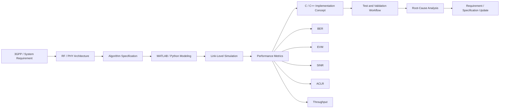

<div align="center">


[](https://www.linkedin.com/in/md-moklesur-rahman-65a63962/)
[](https://github.com/dipucwc)
[](mailto:moklesur.eee@gmail.com)
[](#)

<h3>Wireless/RF/PHY System Engineer | 5G NR & 6G | Massive MIMO | Beamforming/BF Calibration | MATLAB · Python · C/C++</h3>

</div>

## Executive Profile

I am a **Wireless/RF/PHY System Engineer** with **7+ years of industry and research experience** across **5G/LTE radio systems, RF/PHY algorithm specification, signal-processing simulation, massive-MIMO radio development, and wireless validation workflows**.

My GitHub profile is organized as an **engineering portfolio**, not only a code archive. Each project is designed to show the connection between requirement analysis, algorithm design, simulation, implementation concept, validation metrics, and technical documentation.

| Core Positioning | Technical Focus |
|---|---|
| **5G NR / 6G Wireless Systems** | RF/PHY algorithms, massive MIMO, OFDM, beamforming, synchronization |
| **RF Architecture & Specification** | BF/BFC, carrier configuration, timing, DPD behavior, IQ capture, validation flow |
| **Simulation & Validation** | MATLAB, Python, C/C++, BER, EVM, SINR, throughput, spectral efficiency |
| **Research & Testbed Experience** | OpenAirInterface, LTE/5G RAN-core integration, BLE performance evaluation |

---

## System-Level Wireless Engineering Workflow



---

## Professional Experience Highlights

### Nokia Solutions and Networks Oy — Oulu, Finland

**Senior System Specification Engineer — RF Architecture & Specification**  
**Apr 2023 – May 2026**


**System Specification Engineer — RF Architecture & Specification**  
**Sep 2022 – Mar 2023**

### Nokia Bell Labs Collaboration — Oulu, Finland

**Embedded RF Workflow / Hardware Validation Collaboration**  
**Jul 2023 – Jun 2024**

### Center for Wireless Communications, University of Oulu — Finland

**Researcher / Research Assistant / Research Intern**

---

## Main Technical Domains

<table>
<tr>
<td width="50%">

### RF / PHY / 5G NR

- 5G NR, LTE, Wi-Fi concepts
- Massive MIMO and OFDM/OFDMA
- Beamforming and Beamforming Calibration
- Synchronization and Timing
- Carrier Configuration and RF constraints
- Channel Estimation: LS, MMSE, Wiener-MMSE
- Equalization: ZF and MMSE
- Link Adaptation and AMC
- BER, EVM, SINR, throughput, spectral efficiency

</td>
<td width="50%">

### RF Architecture / Verification

- RF/PHY system specification
- 3GPP-inspired requirement analysis
- DPD and PA linearization concepts
- TX/RX processing chains and TRX architecture
- IQ capture timing and validation workflow
- Root-cause analysis and issue debugging
- ADS / Cadence / RF circuit analysis concepts
- VNA, signal analyzer, and oscilloscope knowledge

</td>
</tr>
<tr>
<td width="50%">

### Simulation / Programming

- MATLAB for DSP and PHY simulation
- Python for modeling, plotting, and automation
- C/C++ for algorithm-to-firmware implementation concepts
- Shell/Bash and Linux workflows
- CMake, Git, VS Code
- Wireshark for signaling analysis
- OpenAirInterface build and deployment experience

</td>
<td width="50%">

### Engineering Process

- Feature definition and feasibility analysis
- CFAM-style algorithm/system specification
- Architecture review and requirement traceability
- HW/RF/FW/test alignment
- Technical reports with equations and result analysis
- Release-oriented documentation discipline
- Verification, validation, and RCA workflow

</td>
</tr>
</table>

---

## Featured Engineering Portfolio

<div align="center">

| Repository | Technical Focus | What It Demonstrates |
|---|---|---|
| [`wireless-system-simulation-validation`](https://github.com/dipucwc/wireless-system-simulation-validation) | MATLAB/Python wireless simulation and validation | Practical RF/PHY simulation workflow, result generation, EVM/SINR/throughput analysis |
| [`5G-NR-6G-Wireless-Engineering-Portfolio`](https://github.com/dipucwc/5G-NR-6G-Wireless-Engineering-Portfolio) | 5G NR, 6G, RF, channel modeling, beamforming | Broad wireless-engineering portfolio with MATLAB, Python, and C structure |
| [`PHY-Algorithm-Design-Firmware-Implementation`](https://github.com/dipucwc/PHY-Algorithm-Design-Firmware-Implementation) | OFDM sync, MIMO-OFDM, channel estimation, equalization, AMC | Algorithm-to-firmware thinking with model, implementation concept, and validation metrics |
| [`5G-RF-Architecture-Specification-Verification`](https://github.com/dipucwc/5G-RF-Architecture-Specification-Verification) | RF architecture, specification, verification, RCA | Specification-driven RF architecture and validation case-study structure |
| [`RF-Microwave-Circuit-Design-Portfolio`](https://github.com/dipucwc/RF-Microwave-Circuit-Design-Portfolio) | ADS, Cadence, S-parameters, matching, ACPR/EVM/IP3 | RF/microwave circuit and RF-performance engineering portfolio |
| [`Energy-Efficiency-Evaluation-of-Bluetooth-5-BLE-5-Technology`](https://github.com/dipucwc/Energy-Efficiency-Evaluation-of-Bluetooth-5-BLE-5-Technology) | BLE 5 coded PHY, energy, PER, range | Research-based wireless evaluation with MATLAB and measurement-aligned modeling |
| [`Multi-Connectivity-in-IoT-Network`](https://github.com/dipucwc/Multi-Connectivity-in-IoT-Network) | IoT multi-connectivity simulation | Wireless connectivity performance analysis using MATLAB/Python concepts |
| [C-CPP-Programming-and-Algorithms](https://github.com/dipucwc/C-CPP-Programming-and-Algorithms) | C/C++ algorithms, data structures, memory management, and object-oriented programming | Software-development and problem-solving skills through structured programming projects |
| [Arduino-Embedded-Systems-and-Automation](https://github.com/dipucwc/Arduino-Embedded-Systems-and-Automation) | Embedded control, sensors, hardware interfaces, displays, motors, and automation | Practical microcontroller programming, non-blocking control, and hardware integration |
| [DSP-Algorithm-Design-and-Implementation](https://github.com/dipucwc/DSP-Algorithm-Design-and-Implementation) | FFT, spectrum analysis, FIR/IIR filtering, and fixed-point DSP | DSP algorithm design, numerical implementation, result analysis, and verification |
| [Matlab-Simulink-System-Modeling-and-Testbench-Validation](https://github.com/dipucwc/Matlab-Simulink-System-Modeling-and-Testbench-Validation) | MATLAB algorithm simulation, Simulink system modeling, and testbench validation | Model-based design, subsystem integration, testbench development, and performance verification |

</div>

---
---

## Selected Project Matrix

| Repository | Main Domain | Algorithms / Methods | Tools | Output |
|---|---|---|---|---|
| [5G NR / 6G Wireless Engineering Portfolio](https://github.com/dipucwc/5G-NR-6G-Wireless-Engineering-Portfolio) | Wireless systems | MIMO, beamforming, link budget, channel modeling | MATLAB, Python, C | Reports, simulations, figures |
| [PHY Algorithm Design & Firmware Implementation](https://github.com/dipucwc/PHY-Algorithm-Design-Firmware-Implementation) | PHY/DSP | OFDM sync, LS/MMSE, ZF/MMSE, AMC, Viterbi, Q15 | MATLAB, Python, C/C++ | Link-level models, firmware concepts |
| [5G RF Architecture, Specification & Verification](https://github.com/dipucwc/5G-RF-Architecture-Specification-Verification) | RF system architecture | BF/BFC, timing, carrier config, IQ verification | MATLAB, Python, C | Specification-style validation |
| [RF / Microwave Circuit Design Portfolio](https://github.com/dipucwc/RF-Microwave-Circuit-Design-Portfolio) | RF/microwave | S-parameters, matching, NF, stability, IP3, EVM | ADS, Cadence, KiCad | Circuit studies and analysis |
| [Wireless System Simulation & Validation](https://github.com/dipucwc/wireless-system-simulation-validation) | Simulation validation | Beam sweeping, beam selection, wireless testing workflow | MATLAB, Python | Simulation cases and analysis |
| [BLE Energy Efficiency Evaluation](https://github.com/dipucwc/Energy-Efficiency-Evaluation-of-Bluetooth-5-BLE-5-Technology) | BLE / IoT | PER, range, energy, channel models | MATLAB | Thesis-related evaluation |
| [Multi-Connectivity in IoT Network](https://github.com/dipucwc/Multi-Connectivity-in-IoT-Network) | IoT connectivity | Throughput, latency, packet loss, reliability | MATLAB / Python | Performance evaluation |
| [C/C++ Programming and Algorithms](https://github.com/dipucwc/C-CPP-Programming-and-Algorithms) | Software development | Algorithms, data structures, memory management, object-oriented programming | C, C++ | Programming projects and algorithm implementations |
| [Arduino Embedded Systems and Automation](https://github.com/dipucwc/Arduino-Embedded-Systems-and-Automation) | Embedded systems | Sensor acquisition, hardware interfaces, motor control, displays, automation | Arduino, Embedded C/C++ | Embedded control and automation projects |
| [DSP Algorithm Design and Implementation](https://github.com/dipucwc/DSP-Algorithm-Design-and-Implementation) | Digital signal processing | FFT, spectrum analysis, FIR/IIR filtering, fixed-point processing | MATLAB, Python | DSP models, analysis, and verification |
| [MATLAB and Simulink System Modeling and Testbench Validation](https://github.com/dipucwc/Matlab-Simulink-System-Modeling-and-Testbench-Validation) | System modeling and validation | Algorithm simulation, Simulink testbench design, subsystem integration, performance verification | MATLAB, Simulink | Simulation models, testbenches, and validation results |

---


## Recommended Pinned Repositories

<div align="center">

<a href="https://github.com/dipucwc/wireless-system-simulation-validation">
  
</a>
<a href="https://github.com/dipucwc/5G-NR-6G-Wireless-Engineering-Portfolio">
  
</a>

<br><br>

<a href="https://github.com/dipucwc/PHY-Algorithm-Design-Firmware-Implementation">
  
</a>
<a href="https://github.com/dipucwc/5G-RF-Architecture-Specification-Verification">
  
</a>

<br><br>

<a href="https://github.com/dipucwc/RF-Microwave-Circuit-Design-Portfolio">
  
</a>
<a href="https://github.com/dipucwc/Energy-Efficiency-Evaluation-of-Bluetooth-5-BLE-5-Technology">
  
</a>

</div>

---

## Algorithms & Methods

<div align="center">

| Category | Methods / Topics |
|---|---|
| **OFDM / MIMO** | FFT/IFFT, CP insertion/removal, pilot mapping, MIMO channel matrix modeling, ZF/MMSE detection |
| **Channel Estimation** | LS, MMSE, Wiener-MMSE, pilot-aided estimation, interpolation, NMSE analysis |
| **Beamforming** | Array response, complex weights, phase/amplitude mismatch, BF/BFC calibration, CAZAC/Zadoff-Chu calibration concepts |
| **RF Impairments** | EVM, ACLR/ACPR, IQ imbalance, phase-noise concepts, PA nonlinearity, DPD behavior |
| **Link Metrics** | BER, PER, EVM, SINR, throughput, spectral efficiency, capacity |
| **Validation** | MATLAB/Python reference model, C/C++ implementation concept, regression checks, result plots, technical report |

</div>

---

## Tools & Technologies

<div align="center">

### Programming, Simulation & Firmware


### Wireless, RF & Test


### Engineering Platforms


</div>

---

## Selected Engineering Highlights

- **RF/PHY algorithm specification:** BF/BFC, Synchronization & Timing, Carrier Configuration, Beam Management, DPD-related RF behavior.
- **Architecture and feature definition:** functional block responsibilities, algorithm procedure workflows, interface alignment, and CP1/CP2/CP3 release-oriented work.
- **Simulation and validation:** MATLAB-based PHY/RF modeling, algorithm robustness analysis, calibration timing, RF-chain mismatch, timing alignment, and performance metrics.
- **Cross-functional engineering:** RF/HW/FW/test coordination, system-level reviews, root-cause analysis, and customer-driven issue investigation.
- **Research and testbed work:** OpenAirInterface LTE/5G testbed deployment, S1AP/NAS signaling analysis with Wireshark, BLE performance research with MATLAB and lab validation.
- **Embedded/RF workflow:** Linux, SSH/SCP, CLI/HW control concepts, UL/DL calibration weight computation, IQ capture timing, and signal insertion/capture workflow.

---

## Publication & Research Background

**Performance Evaluation of Bluetooth Low Energy Technology Under Interference**  
H. Karvonen, K. Mikhaylov, D. Acharya, and **M. M. Rahman**, 2018.  
Research area: BLE 4 / BLE 5 coded PHY, interference analysis, PER, range, energy efficiency, analytical modeling, MATLAB simulation, and measurement-aligned validation.

---

## GitHub Activity

<div align="center">


</div>

---

## Current Portfolio Direction

```text
Goal:
Build an engineering-grade public portfolio for 5G NR, 6G, RF, PHY, and wireless validation roles.

Focus:
1. MATLAB/Python/C simulation projects
2. Technical reports with equations and result analysis
3. RF/PHY algorithm design and verification workflows
4. Algorithm-to-firmware implementation structure
5. Recruiter-readable project summaries
6. Senior-engineer-readable technical depth
```

---

## Open to Roles / Collaboration

I am open to opportunities in:

- Wireless System Engineering
- RF System Engineering
- PHY Algorithm Design
- 5G/6G Research Engineering
- RF Test & Validation
- OTA / RF Verification
- Algorithm-to-Firmware Implementation
- RAN / O-RAN / AI-RAN related engineering

**Location:** Oulu, Finland  
**Mobility:** Finland and Europe  
**Work authorization:** EU permanent residence; no sponsorship required within the EU

---
## Learning and Research Interests

- 6G PHY and AI-native radio access
- NTN and satellite wireless receiver algorithms
- MIMO-OFDM link-level and system-level simulation
- O-RAN / AI-RAN architecture and validation workflows
- RF impairment modeling, PA linearization, and DPD
- OTA/MPAC chamber validation methodology
- Algorithm-to-firmware implementation for RF/PHY systems
---
---

## Profile Roadmap

- Expand each portfolio repository with complete technical reports, equations, simulation workflow, and reproducible results.
- Add MATLAB and Python verification scripts for every wireless/RF project.
- Add C/C++ algorithm-to-firmware examples for selected PHY modules.
- Add result figures: BER/EVM/SINR/throughput/ACLR/capacity plots.
- Keep repositories aligned with Wireless System Engineer, RF System Engineer, PHY Algorithm Engineer, and Test & Validation roles.
---

### Focused on practical RF/PHY engineering: from algorithm specification to simulation, verification, and implementation.


</div>
---
<div align="center">

### Specification is strongest when it is connected to simulation, validation, and measurable RF/PHY performance.


</div>
